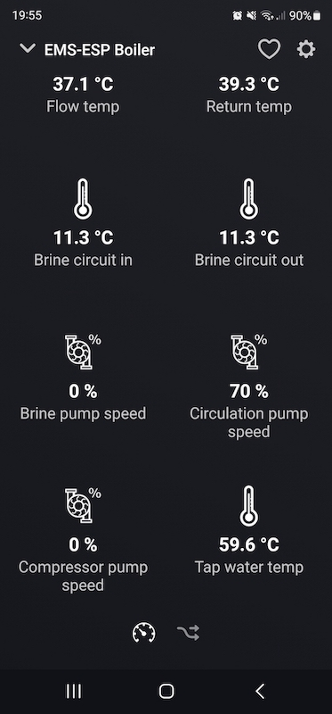

# Homey Pro app for EMS-ESP

Adds thermostat and boiler support for the Homey Pro in a simplistic manner. Use it for inspiration and as a launch pad for your own project.

Communication with EMS-ESP is done via HTTP/REST.

# Getting Started

Install the [Homey CLI](https://apps.developer.homey.app/the-basics/getting-started#1.-install-homey-cli) then run the following [command](https://apps.developer.homey.app/the-basics/getting-started#3.-run-the-homey-app) to start the Homey app on your device of choice.

```
homey app run
```

## Tested on

- Homey Pro (early 2023)
- IVT Geo 600 heat pump

## Implemented entities

### Thermostat

- target_temperature (read/write)
- dampedoutdoortemp (read)
- hc1_hpoperatingstate (read)

### Boiler

- curflowtemp (read)
- hpbrinein (read)
- hpbrineout (read)
- hpbrinepumpspd (read)
- hpcircspd (read)
- hpcompspd (read)
- lastcode (read)
- rettemp (read)
- wwcurtemp (read)


